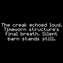
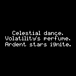
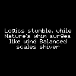

# Pif

This project is a hardware device that displays poetry that is generated through a series of API calls to gpt-3.5-turbo. 

### Example poetry generations





## Overview

High-level, this application gathers and displays poetry and text data. The repository provides Dockerfiles to run both the Postgres database and the client side with the application 'Poem-App'

Application is designed to be used with Dockerfiles and run with docker-compose.

This project uses a Raspberry Pi zero running Raspbian and a small 128x128 waveshare display. 

Project is named Pif for Poetry Friend

## 360 x 240 black and white e-Paper version

This edition uses 3.52inch e-Paper and has 360 x 240 pixel resolution in black and white

## Explanation of contents of this repository 

Poem-App python scripts explanation:
 - init-postgres-pif.py initializes the postgres database and creates a database "game" with a table "poem_game" using psycopg2 driver
 - main.py is the main script that creates game instances and writes and reads from the database to manage game state 
 - intro_vars module contains introductory text snippets that are displayed in new game instances only 
 - create_vars.py module is used to generate random words which are then fed into the poem_gem text generation pipeline, also used to maintain lists of known variables that are then used as a base for text generation: themes, characters, linguistic devices. 
 - poem_gen.py module is the main poetry/text generation module that has a series of pipelines of API calls to gpt-3.5-turbo
 - display_write_poem.py writes to hardware display using PIL 

Helper folder contains unit tests and helpful utility scripts such as getmodels.py to see all available openai gpt models 
Lyrics-api folder contains logic to use musicxmatch lyrics API, is currently not implemented 

## Overview of Pif game architecture: game state management

```
┌─────────────────────┐             ┌──────────────────────────────────────┐
│                     │             │                                      │
│                     │             │                                      │
│  new game?          ├─────────►   │ read from database:                  │
│  (existing id?)     │  no         │ session_id, entropy level            │
│                     │             │                                      │
└──────────┬──────────┘             │                                      │
           │                        └─────────────────┬────────────────────┘
           │  yes                                     │
           ▼                                          ▼
┌─────────────────────┐                ┌───────────────────────────────┐
│                     │                │                               │
│                     │                │                               │
│   create new id     │                │   poetry generation           │
│   assign entropy    │                │   pipeline --> generate &     │
│   introduction text │                │   display text                │
│                     │                │                               │
└─────────────────────┘                └───────────────────────────────┘
```

## Overview of Pif game architecture: poetry generation pipeline

```
        create_vars                                   poem_gen
┌───────────────────────────────────┐    ┌───────────────────────────────────┐
│                                   │    │                                   │
│  nltk.corpus.webtext.fileids      │    │  set entropy                      │
│  --> select random file           │    │                                   │
│  --> select a set of random words │    │  API call step 1                  │
│                                   │    │                                   │
│  base API call:                   │    │  - you are {persona}              │
│  create a short sentence based    │    │  - write a poem about {output}    │
│  on the following: {nltk_words}  ─┼───►│                                   │
│                                   │    │  API call step 2                  │
│  define: personas                 │    │                                   │
│   - persona                       │    │  - incorporate {concept}          │
│   - concept                       │    │                                   │
│   - linguistic device             │    │  API call step 3                  │
│                                   │    │  - introduce variation            │
└───────────────────────────────────┘    └───────────────────────────────────┘
```


